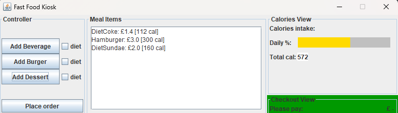

# Developing a Food Kiosk GUI with the MVC pattern
The aim is to develop a GUI for a kiosk simulating the touch-screen devices placed in fast-food 
restaurants that allow customers to customise their meals and place their orders before collecting their food at the pickup location:
